# Electricity Billing System (EBS)
An Electricity Billing System automates the process of managing customer records, meter readings, and bill generation. It calculates charges based on consumption, applies tariffs, and tracks payments. The system improves accuracy, reduces manual errors, and ensures efficient, transparent billing.

An **Electricity Billing System (EBS)** developed in **Java Swing** with a **MySQL** backend. This system is designed for electricity providers to manage customers, bills, payments, and load bifurcation efficiently. It provides a **desktop GUI** that is intuitive, responsive, and easy to use.


---

## Features

- **User Authentication**: Secure login for admins.
- **Customer Management**: Add new customers and view their details.
- **Billing System**: Generate and validate monthly electricity bills.
- **Payment Handling**: Record and track bill payments.
- **Load Bifurcation**: Calculate and display electricity distribution details.
- **Database Integration**: MySQL backend for persistent storage of customer, bill, and payment data.
- **User-Friendly GUI**: Sidebar navigation with pop-up menus for quick access to actions.

---

## Table of Contents

1. [Login Module](#login-module)
2. [Home Page](#home-page)
3. [Customer Management](#customer-management)
   - [Add Customer](#add-customer)
   - [Customer Details](#customer-details)
4. [Billing Module](#billing-module)
   - [Generate Bill](#generate-bill)
   - [Bill Preview](#bill-preview)
   - [Bill Table & Validation](#bill-table--validation)
5. [Payment Module](#payment-module)
   - [Pay Bill](#pay-bill)
6. [Bifurcation Calculator](#bifurcation-calculator)
7. [MySQL Database](#mysql-database)
8. [Screenshots](#screenshots)
9. [Technologies Used](#technologies-used)
10. [Conclusion](#conclusion)

---

## Login Module

The **Login Page** authenticates administrators before allowing access to the EMS.

- **Login.png**: The Login Page secures access to the EMS. Admins enter their username and password to proceed, with validation ensuring only authorized users can access the system.
  
  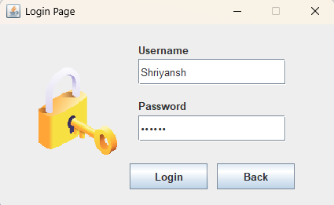
  
- **LoginSuccess.png**: Successful login redirect.
  
  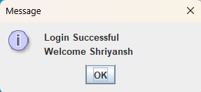
  
- **LoginValidation.png**: The Login Validation checks entered credentials. If incorrect, it shows an error alert; if correct, it allows access to the Home Page.
  
  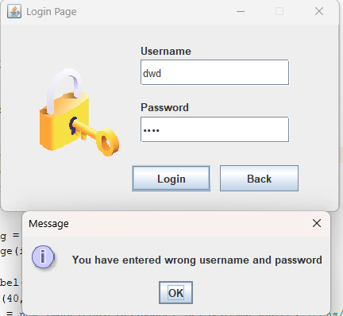
  
- **Logintable.png**: Admin credentials table in MySQL.
  
  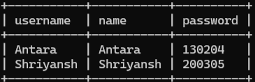

**Workflow:**

1. Enter **username** and **password**.
2. Validation against the database.
3. On success, redirect to **Home Page**.

---

## Home Page

The **Home Page** serves as the main dashboard after login.

- **HomePage.png**: Displays sidebar navigation, pop-up menus, and background image.

**Features:**

- Sidebar with buttons: `Customer`, `Payment`, `Bifurcation`, `Logout`.
- Pop-up menus for quick actions.
- Menu bar for File, Edit, Help.

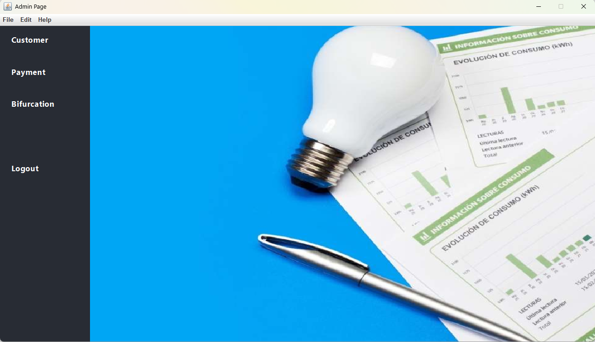

---

## Customer Management

### Add Customer

Allows adding new electricity customers.

- **CustomerItems.png**: Shows menu items under Customer.
- **AddCustomer.png**: Form for adding customer details.
- **AddedSuccess.png**: Confirmation after successful addition.

**Customer Fields:**

- Name, Meter Number, Address, City, State, Phone Number, Email

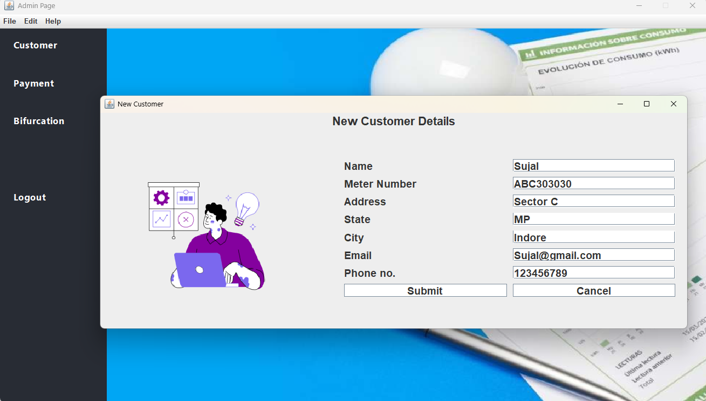

### Customer Details

Displays all customers in a tabular format.

- **CustomerTable.png**: Table view of all customers.
- **CustomerDetails.png**: Detailed information of a selected customer.

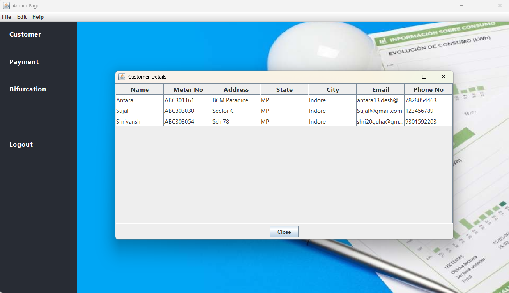

---

## Billing Module

### Generate Bill

Generate bills for a customer for a specific month.

- **GenerateBill.png**: Bill generation input screen.

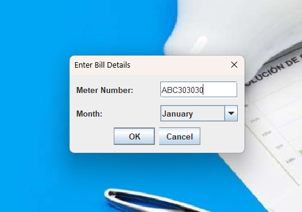  

### Bill Preview

The **Bill Preview** displays the generated electricity bill for a customer. It includes customer details, meter number, billing month, units consumed, and total amount. This screen allows verification before finalizing or printing the bill.

- **Bill.png**: Shows the detailed generated bill for a selected customer and month.

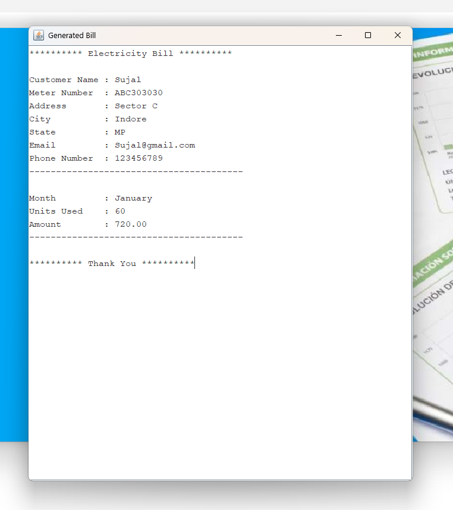  

### Bill Table & Validation

Manage all generated bills and ensure proper records.

- **BillTable.png**: Table of all generated bills.
- **BillValidation.png**: Validates if a bill exists before generating.
- **BillPaid.png**: Shows bills that have been paid.

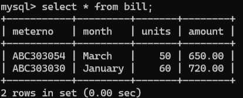

---

## Payment Module

### Pay Bill

Record payments made by customers.

- **PaymentItems.png**: Shows menu items under Payment.
- **PayBill.png**: Payment entry screen.

**Workflow:**

1. Select customer by **Meter Number**.
2. Enter payment details.
3. System updates bill status and logs payment in the database.

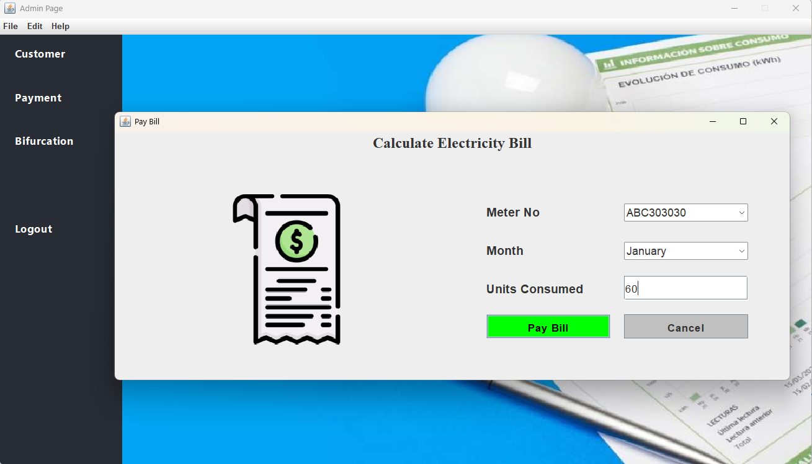

---

## Bifurcation Calculator

Calculate and visualize electricity load distribution.

- **BifurcationCalculator.png**: Input fields and calculated bifurcation results.

**Features:**

- Enter load details for a customer or region.
- Calculate electricity distribution automatically.

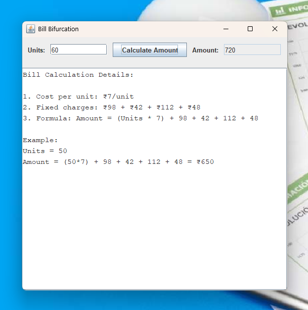

---

## MySQL Database

The EMS uses **MySQL** to store customer, bill, and payment information.

**Tables:**

- `addcustomer`: Stores customer information.
- `bill`: Stores monthly electricity bills.
- `payment`: Records payments made.

**Screenshots:**

- `CustomerTable.png`: Customer data in DB.
- `BillTable.png`: Bill records.
- `Logintable.png`: Admin login credentials.

---

## Screenshots

Here is a visual walkthrough of the **Electricity Management System (EMS)**. All screenshots are stored in the `screenshots/` folder.

| Module | Screenshot |
|--------|------------|
| Login Page |  |
| Login Validation |  |
| Successful Login |  |
| Home Page |  |
| Customer Menu Items | 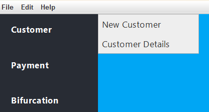 |
| Add Customer Form |  |
| Customer Added Success | 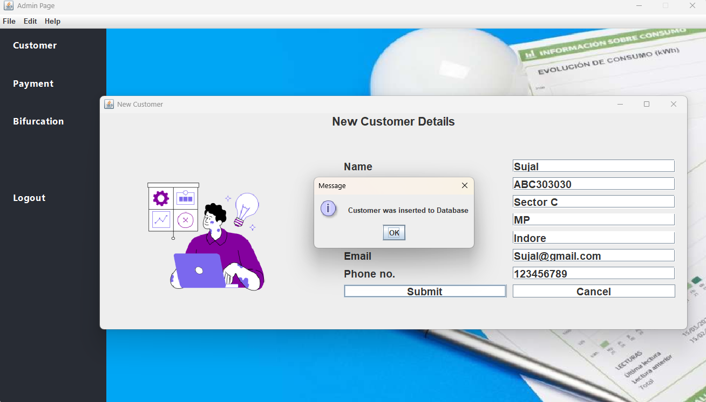 |
| Customer Details |  |
| Customer Table | 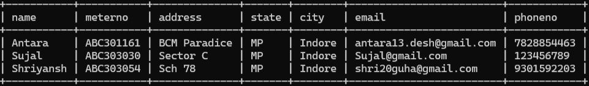 |
| Payment Menu Items | 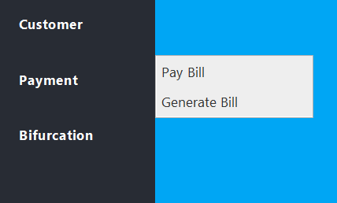 |
| Pay Bill |  |
| Generate Bill Form |  |
| Bill Preview |  |
| Bill Paid Confirmation | 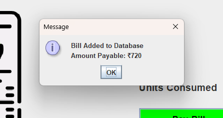 |
| Bill Table |  |
| Bill Validation | 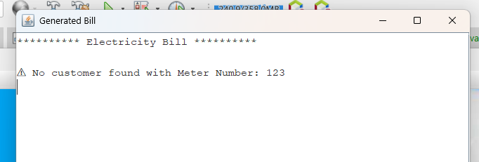 |
| Bifurcation Calculator |  |
| Login Table in MySQL |  |

---

## Technologies Used

The EMS project uses the following technologies:

- **Java Swing** – For creating the graphical user interface (GUI).  
- **Java AWT** – For layout management and event handling.  
- **MySQL** – Relational database to store customer, bill, and payment data.  
- **JDBC (Java Database Connectivity)** – To connect Java applications with the MySQL database.  
- **PreparedStatement & ResultSet** – For secure and efficient database queries.  
- **JOptionPane** – For pop-up dialogs and input forms.  
- **JScrollPane & JTextArea** – For displaying generated bills in a scrollable format.  
- **GridLayout & BorderLayout** – For organized layout of panels and buttons.  

---

## Conclusion

The **Electricity Management System (EMS)** is a robust, desktop-based application for electricity providers to manage customers, bills, and payments efficiently.  

Key takeaways:

- Provides **secure login** and **role-based access**.  
- Simplifies **customer management** with add/view functionality.  
- Automates **billing and payment processing**.  
- Supports **bifurcation calculations** for electricity distribution.  
- Fully integrated with **MySQL** for persistent data storage.  
- Extensible and ready for future enhancements like analytics, reporting, and automated billing.  

With a **user-friendly interface** and well-structured backend, EMS serves as a complete solution for electricity management operations.

---

**Sample Queries:**

```sql
-- Add a new customer
INSERT INTO addcustomer (name, meterno, address, city, state, phoneno, email)
VALUES ('John Doe', '12345', '123 Street', 'City', 'State', '9876543210', 'john@example.com');

-- Generate a bill
INSERT INTO bill (meterno, month, units, amount)
VALUES ('12345', 'August', 120, 1500);

-- Record payment
INSERT INTO payment (meterno, amount, date)
VALUES ('12345', 1500, '2025-09-01');
